# Topic 10 - AWS + Go Operator + FluxCD + Crossplane + ArgoCD
##  Yuanchao Hands-on Project

## This readme is more readable [here](https://github.com/lyc-handson-AWS/handson-topic10)


## **Overview**

#### **Project's main features**

:point_right: Customized Go Kubernete Operator

:point_right: [Gitops]A Kubernetes cluster bootstrapped/managed by FluxCD

:point_right: [Gitops]Services/Applications managed by ArgoCD

:point_right: AWS resources created/controlled by Crossplane

:point_right: Program interact with AWS Resources


#### **Project's Github repos**

- [handson-topic10](https://github.com/lyc-handson-AWS/handson-topic10)

- [handson-topic10-fluxcd-infra](https://github.com/lyc-handson-AWS/handson-topic10-fluxcd-infra)

- [handson-topic10-product2](https://github.com/lyc-handson-AWS/handson-topic10-product2)

- [handson-topic10-product1](https://github.com/lyc-handson-AWS/handson-topic10-product1)

- [handson-topic10-services](https://github.com/lyc-handson-AWS/handson-topic10-services)

- [handson-topic10-operator](https://github.com/lyc-handson-AWS/handson-topic10-operator)

- [handson-topic10-go](https://github.com/lyc-handson-AWS/handson-topic10-go)


## What could be learned in this topic:

#### AWS SDK for Go

:point_right:How to write a go program using/connecting/communicating with AWS resources(Cloudwatch-Loggroup/S3-Bucket/DynamoDB-Table/KMS-key)

#### Go SDK Operator

:point_right:How to write/build/debug/deploy a kubernete operator

#### Crossplane

:point_right:How to create AWS ressource as Kubernet resources via Crossplane 

:point_right:How to create XL/XLR/compostiion of Crossplane to pacakge resources 

#### FluxCD

:point_right:How to bootstrap a cluster with FluxCD

:point_right:How to integrate a source to FluxCD

:point_right:How to define HelmRelease/HelmRepo sources in FluxCD

:point_right:How to define Kustomization in FluxCD

:point_right:How to check/reconcile a Kustomization in FluxCD

#### ArgoCD

:point_right:How to initiate ArgoCD with customized local roles/users, policies

:point_right:How to add Applications to ArgoCD

:point_right:How to define Projects and project's roles in ArgoCD

:point_right:How to use app of apps to manage dependences between applications in ArgoCD


## **Architecture**

the diagram below illustrates the architecture(principle) of this project:


## How to replicate this Topic 
1. Fork all repos inside this topic

2. Run this command on the environment where there is the Kube context of your cluster to bootstrap with FluxCD

   > [!TIP]
   >
   > needs to install FluxCD CLI in the environment where you execute commands

   ```bash
   export GITHUB_TOKEN=your_github_token
   flux bootstrap github \
     --token-auth \
     --owner=owner_of_your_repo \ # if you do the fork, the namespace/group of your repo
     --repository=handson-topic10-fluxcd-infra \
     --branch=main \
     --path=clusters/my-cluster
   ```

3. install operator controller to cluster

   > [!TIP]
   >
   > check detailed infos about operator in the operator chapter

   1. check in the cluster the CRD topicten is already installed

   2. clone the operator repo

   3. inside the operator repo run 

      ```bash
      make deploy
      ```

4. Initiate some ArgoCD configurations

   > [!TIP]
   >
   > needs to install ArgoCD CLI in the environment where you execute commands
   >
   > check the detailed procedures or commands in the ArgoCD chapter or in the repo.

   1. you can first check on ArgoCD page : Settings/Project/ the 2 projects and its configurations were already there

   2. create local users by patching argocd-cm

   3. Add the permissions for these users and project's roles or other your own users permissions/policies/roles by patching argocd-rbac-cm 

   4. check users and initiate their password, so you can login with local users

   5. Do a git clone on current repo 'handson-topic10' or just download the 2 Application manifest file application-app1.yaml & application-app2.yaml

   6. run this command to deploy/upadte 2 applications(make sure the user login has the permission to create an application inside its project)

      > [!CAUTION]
      >
      > update the repo urls to the new location for 2 applications and its sub-apps before run this command

      ```bash
      argocd app create -f argocd/app1/application-app1.yaml  --upsert
      ```

5. you will see the applications will appear on the ArgoCD page

6. For the applications "prodoct". they will be synchronized automatically.

7. For the applications "service", synchronize them manually via ArgoCD


## FluxCD implementation

### Code

Check the FuxCD implementation [here](https://github.com/lyc-handson-AWS/handson-topic10-fluxcd-infra)

### Repo structure

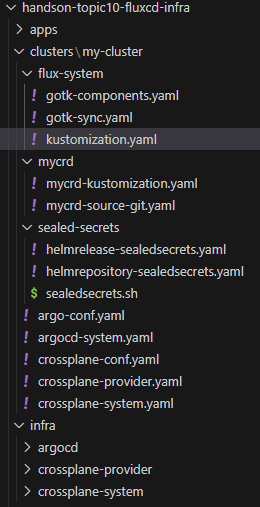

### Before deeper look

1. FluxCD is better for me to manage a Kube cluster on infra level(than ArgoCD) by DevOps(Ops) infra/cluster team for the below reasons:
   1. by default, it will gain(use) admin access to Cluster.
   1. it's more obvious to put all managed CRs/projects/applications to Kube manifest and push them to git. so the duplication/backup process would be more easier and clear
   1. the templating & modularization are more easier to achieve when everything is represented by Kube manifest
   1. when debugging. it's more convenient to interact Flux by CLI and more appreciated by Ops 😁
   
1. FluxCD's bootstrap of my project is based on a Github Organisation repo, check other possibilities with other codebase/platform types https://fluxcd.io/flux/installation/bootstrap/
1. **Reconcile/reconciliation** is the terms used by FluxCD to describe the automatic process which synchronize/build/deploy/update Kube resources

​	

### Understand deeply

- **the FluxCD is deployed by this command to my Kubernetes cluster**, the command creates 2 FluxCD CRs(gotk-sync.yaml): GitRepository & Kustomization 

  ```bash
  flux bootstrap github \
    --token-auth \
    --owner=lyc-handson-AWS \
    --repository=handson-topic10-fluxcd-infra \
    --branch=main \
    --path=clusters/my-cluster
  ```

  - GitRepository is one of FluxCD 'source' type which works as artifact of FluxCD, FluxCD can only reconcile inside a known source. Other possible source types: 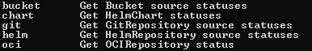
  - FluxCD Kustomization represents the application of FluxCD. it search every possible Kube classic 'Kustomize'  action and FluxCD CRs inside a 'source' under a specific path(clusters/my-cluster), and try to apply them inside the cluster. if it see antoher FluxCD Kustomization, it will create it inside FluxCD, and this application will repeat the same actions.
  
- once the FluxCD's initialization is done, **we can put more Kustomization/CRs into path 'clusters/my-cluster/'** to create other applications or reconcile other resources

- a FluxCD Kustomization example with crossplane-provider.yaml

  > [!NOTE]
  >
  > See Crossplane section about providers

  - this FluxCD Kustomization indicate that they are 'Kustomize'  action or FluxCD CRs inside ./infra/crossplane-provider for Crossplan's providers

  ```yaml
  apiVersion: kustomize.toolkit.fluxcd.io/v1
  kind: Kustomization
  metadata:
    name: crossplane-provider
    namespace: flux-system
  spec:
    dependsOn:
     - name: crossplane
    interval: 10m0s
    sourceRef:
      kind: GitRepository
      name: flux-system
    path: ./infra/crossplane-provider
    prune: true
    wait: true
    timeout: 5m0s
  ```

  - so FluxCD add this application with name crossplane-provider and track the states inside. and this application will seek if other resources to add or to reconcile inside the target path.

  - each time a change is pushed to this repo under this path, FluxCD will try to reconcile and synchronize the last commit to the application "crossplane-provider", as long as the kustomization or one of its resource is not correctly set up, FluxCD will try to continue the action until it consider it as successful or unsuccessful

     

    

- let's see another example with helm for sealed secrets

  > [!NOTE]
  >
  > Sealed Secrets is a Kube operator for encrypting Kube secret manifest, so the manifest can be traced and pushed securely to a git repo, when the manifest is deployed to Kube cluster, Sealed Secrets controller will decrypt the manifest and generate the real secret resource. for more details: https://github.com/bitnami-labs/sealed-secrets
  >
  > there are other solutions for putting securely Kube Secrets to git like gpg/ape with SOPS, check https://fluxcd.io/flux/guides/mozilla-sops/

  - inside sealed-secrets/, there is no FluxCD application(Kustomization): instead, is a helmrelease. so the helmrelease and helmrepository is part of application flux-system, as the folder is inside the path that it watch and they don't have their own application 

  - So a FluxCD helmrepository type 'source' is created, and in order to be able to reconcile a helm chart, FluxCD helmrelease needs to either create built-in(defined along with the helmrelease 's manifest) chart or use a existing FluxCD chart 'source'. 
  
    

- Repo layers organization

  > [!NOTE]
  >
  > there are many ways to organize repos for the resources controlled by FluxCD, see https://fluxcd.io/flux/guides/repository-structure/
  >
  > there is no strict rule, it's all about how people see/divide/modularize their project/organization, so here is just my way to see my topic
  >
  > all FluxCD Kustomization are put inside the same FluxCD github repo only for presentation reason, they can totally separated in different repos based on the real production needs/organizations.
  
  - layer1-cluster: all the basic components and their sources(git or helm) inside a Kube cluster like FluxCD itself, operators, cluster/infra's level CRDs/CRs... But if a component has sub-components or extra configurations on infra/cluster level, component itself and each of its sub-groups will have their own Flux Kustomization. So the definitions like source, or Kustomize actions of this component will be on the layer 2, and depending on the sub-group's nature its definitions could on layer 2 or layer 3
  - layer2-infra:  also some necessary infra level components which means including layer1, those are the elements that i want to duplicate to every new cluster i could have in the future. they could be used by any application running on the cluster. However they maybe have multiple Kustomizations in addition to the component itself, like different configurations or sub-components. For example: crossplane-system and crossplane-provider, we can't deploy crossplane provider unless corssplane-system had already been deployed, and it's also possible that the crossplane-system repo and crossplane-provider are not managed by the same team, so they should be presented by 2 different applications(Kustomization) inside FluxCD, but they are essentials for other application level resources.
  - layer3-app: those are the customized or specific components level, they could have inside themselves more layers defined by Other team than the cluster Ops team. the commons of these components are they are only necessaries for a/some specific tools/applications but not for infra/cluster. For exmaple,  inside apps/argocd, i put definitions for ArgoCD projects which are not need on cluster/infra level, normally they should be managed in a independent repo for ArgoCD projects organization's definition by a specific team.


## ArgoCD implementation

### Code

Check ArgoCD the AWS reousrces kube mantifest [here](https://github.com/lyc-handson-AWS/handson-topic10-services) 

### Project

> [!CAUTION]
>
> the terme `project` of ArgoCD looks like more to me the notion of an organization or a group

1. the `Pojects` of ArgoCD are pre-deployed by FluxCD, after the deployment of ArgoCD itself,

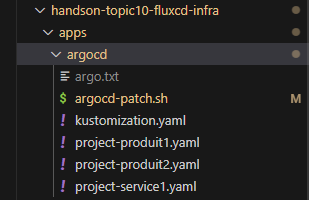

2. inside a `project` we define the projet roles 

   and allowlist & denylist 

   1. for the sources repo
   2. for the destination cluster & namespace
   3. for cluster-scoped resources

3.  the project roles need to be explicitly assigned to a user or a group after


### App Of Apps

> [!NOTE]
>
> there is a new feature `ApplicationSets` that could replace totalely `App Of Apps`, check https://argo-cd.readthedocs.io/en/latest/operator-manual/applicationset/


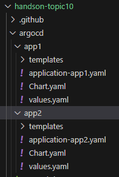

- use `App Of Apps` to intergrate a group of applications

- define a helm chart as the parent app of all my applications. so the file like `application-app1.yaml`is a CR  `Application` of ArgoCD who has  `repoURL`of this repo(helm chart's repo)

- in the `values.yaml`, we can define some common used field, like the destination cluster URL

  ```yaml
  spec:
   destination:
    server: https://kubernetes.default.svc
  ```

  

- in the templates, for each application, we define a `Application` of ArgoCD manifest, as it's also a template file of a helm chart, it can use all helm templating syntax. like this `server: {{ .Values.spec.destination.server }}`

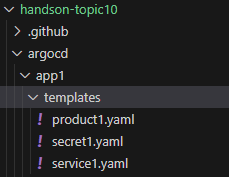


### Applications

- app1 and app2 are kustomized by 2 different way to show 2 different cases that we could face in the real production environment, based on the real team or application organization

- for app1, all kustomization/patch(runtime infos) actions are already defined inside the `prodoct1` repo,  `Application `manifest describe only the app's configurations inside ArgoCD
- for app2, inside the produit1 repo, there are only basic kustomizations about the `product2` itself(static. no-runtime),  the kustomaizations are defined inside the `Application` manifest file

```yaml
  source:
    path: produit2
    repoURL: https://github.com/lyc-handson-aws/handson-topic10-product2.git
    targetRevision: HEAD
    kustomize:
      namePrefix: app2-
      patches:
   - target:
     group: app.lyc-handson-aws.com
     version: v1alpha1
     kind: TopicTen
     name: topicten
     patch: |-
       - op: replace
         path: /spec/replicas
         value: 4
       - op: replace
         path: /spec/cloudwatcharn
         value: "arn:aws:logs:eu-west-3:xxxx:log-group:xxxx:*"
       - op: replace
         path: /spec/kmsarn
         value: "arn:aws:kms:eu-west-3:xxxx:key/xxxx"
       - op: replace
         path: /spec/targetarn
         value: "arn:aws:s3:::service2-topic10-xxxxxx"
```


- each app contains `Applications` product/service/secret

  - except service,  product/secret/parent are synchronized automatically 
  - because service represents in this structure a complex basic dependence of product . So the service should be synchronized manually when it changes


### User Management

> [!NOTE]
>
> inside my topic. i only managed the local user to understand the basis , for other more real user management like SAML or OIDC see https://argo-cd.readthedocs.io/en/latest/operator-manual/user-management/
>
> ArgoCD uses several ConfigMap objects inside its namespace to manage all its configurations 
>
> each ArgoCD ConfigMap has multiple Keys for different configurations, we talk about here only keys of some ConfigMap which impacts our Topic

#### argocd-cm

- need to add users in the key 'data' of argocd-cm, to be able to create local users
- i created below 3 users just for simulating 3 different role
  1. greader: 
  2. ops-project:  the people or group of people who should be able to manage all things related in application side(project/application/repo), but not things related to certificate,account etc, like an ops on DSI side or tech leader/manager of an application team 
  3. ops-infra: the people or team who manage(admin) the infra or kube cluster
- there should have other roles between ops-project and ops-infra, like team who provide some service/configuration/project that the applications are depende of. They can manage a part of infra/cluster, but cant do everything like maybe delete actions etc. That's why if you check path apps/argocd/ inside FluxCD repo, i have defined a project just for `services` 


```json
 "data": {

  "accounts.ops-project": "login",

  "accounts.ops-infra": "apiKey,login",

  "accounts.greader": "login"

 }
```


#### argocd-cm-rbac

the permissions for local users need to be defined inside the `argocd-cm-rbac` with Key `policy.csv`, there are other key of permission for other type of users/groups

```json
 "data": {
  "policy.csv": "p, greader, applications, get, */*, allow
     p, greader, projects, get, */*, allow
     p, role:opsproject, applications, *, */*, allow
     p, role:opsproject, repositories, *, */*, allow\n
     p, role:opsproject, logs, get, *, allow\n
     p, role:opsproject, clusters, *, */*, allow\n
     p, role:opsproject, exec, *, */*, allow
     p, role:opsproject, certificates, sync, */*, deny
     p, role:opsproject, gpgkeys, sync, */*, deny
     p, role:opsproject, accounts, sync, */*, deny
     p, role:opsproject, extensions, sync, */*, deny
     g, ops-project, role:opsproject\n
     g, ops-infra, role:admin"
 }
```


## Crossplane implementation

### Code

Check the AWS reousrces kube mantifest [here](https://github.com/lyc-handson-AWS/handson-topic10-services) 

### Before all

1. Crossplane works as a control plane of AWS resources inside A kube cluster, so 

   1. the CRDs of AWS resources are not included inside Crossplane basic components, but provided by different providers defined by either official providers like AWS itself or Crossplane's interpretation or customized third-part people/organization. Find all possibles providers on [Upbound](https://marketplace.upbound.io/)
   1. it's each provider that defines how to manage a AWS resource, Crossplane is only responsible for communications with AWS and everything inside the Kube
   1. for a same AWS resource like S3 bucket, the possible fields inside spec and the kind's name could be different between the CRD defined by 2 providers.

2. in my project, i have loaded different providers into cluster, i was able to test the different CRs of different providers(AWS/Crossplane) for a same AWS resource. Finally i decided to use for all resources Crossplane provider's CRs in my topic.

3. A secret that contains AWS credentials needs also to be deployed inside the cluster for Crossplane with a CR called ProviderConfig, so Crossplane can use it to communicate with AWS though providers

4. the functions that are used by Composition also needs to be pre-created inside the cluster

5. in my Topic, 3 & 4 are reconciled in advance by FluxCD through Kustomization called 'crossplane-Conf', inside this path

   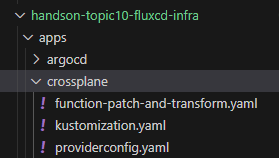

### Service1

> [!NOTE]
>
> service 1 shows how to create different AWS resources with a Kube manifest for each resource

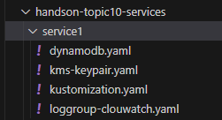


### Service2

> [!NOTE]
>
> service 2 shows how to make one CR(XR) who packages multiple resources together with Crossplane's XRD, XR, Composition 
>
> I put XRD, XR, Composition inside the same Kustomization for a presentation reason. **in a more general way, user only needs to define a XR, then he can have the AWS resources that he wants . it's the key point of using XRD of Crossplane, providing a template service**


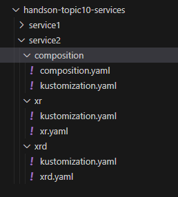

#### Composite Resource Definitions (XRD) & Composite Resource(XR)

1. Define a specific Crossplane schema to create a resource refereed by a composition. it's necessary to create a composition after XRD, otherwise XR can not be instantiated.
2. XRD is equivalent to CRD, XR to CR

#### Composition & function 

1. allow to apply/patch/transform the value of  XR's spec field to one/certain fields of one/certain resource's inside composition

2. provide pipelines to manage resources in stages , so it can also manage dependences/patch between resources inside the composition, like apply a spec value of a resource by another resource's a field's value inside status, after its creation(because the status's fields can only be know after the creation)


## **Go SDK Operator**

#### Code

Check my customized Operator [here](https://github.com/lyc-handson-AWS/handson-topic10-operator) 

### Before all

1. my operator is quite simple, my goal was add a little complex upon the basic example we can find on Internet or inside the docs. **So here are the behaviors of my operator** 
   1. the operator creates a deployment with a given number of replica and given image name. 
   2. operator's CR needs 3 AWS ARNs in spec field, the operator will add 3 ARNs in the pod's environment along with pod name/pod namespace/pod ip
   3. the key control of my operator is:  every minute, it will check the current replica of the CR's deployment. if it's not 1, it will reduce 1 until CR's deployment's replica is only 1.
2. **more instructions about how to create a Go operator**, see https://sdk.operatorframework.io/docs/building-operators/golang/tutorial/ & https://github.com/kubernetes-sigs/kubebuilder

3. while building a operator there are only 2 things to consider
   1. what are the fields inside your CR's spec and status
   2. what are the behaviors of your controller, what it controls and how it do the controlling 


### API object

> [!IMPORTANT]
>
>  Go SDK has its way to define the API object and then transform it to a Kube CRD

- i need to define what are the possible fields inside CR's spec, using `Go annotation` and `Go struct tag` to indicate some properties of each field. all these will be interpreted by the SDK for generating  this Kube CRD's manifest, when run `make manifests`

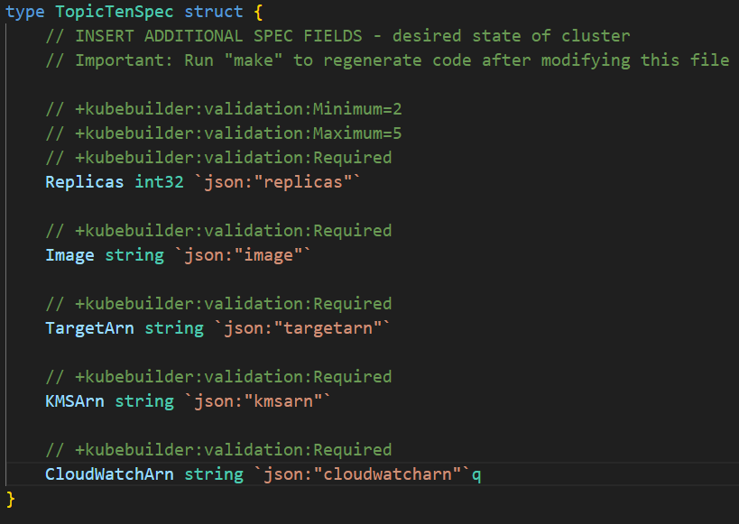

- i need also define what are the possible fields inside CR's status. i only define one field: the current replica number

  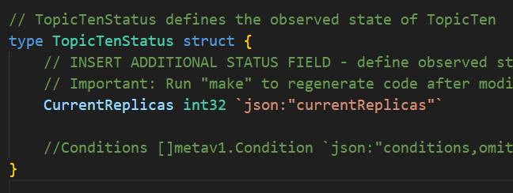

- after these, i still need to add these 2 `structs` to the `struct` who represent API object shema itself and define the fields of CR list

  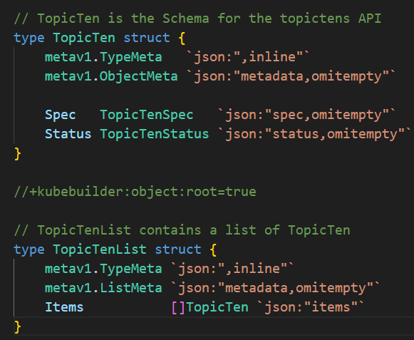

 - now all basic `struts` are there to build a API Object, i can run `make generate` which will update the `zz_generated.deepcopy.go` file in the same folder file to ensure our API’s Go type Object implement the `runtime.Object` interface.


### Controller

**the basic 3 things to define is**

1. the controller's`stuct` 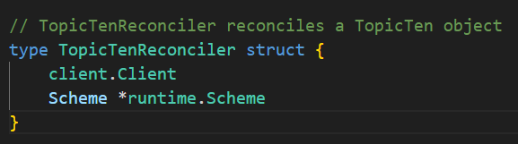
2. the logic of controller via function `Reconcile`  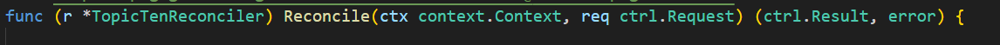
3. the controller's rbac permissions via Go annotation for `Reconcile` function, as in my operator,it will manipulate deployment,  i give him all possibles permission on deployment(but not on pod, because in its logic, it doesn't really interact with pod, but only deployment) along with other auto-generated permissions on my CR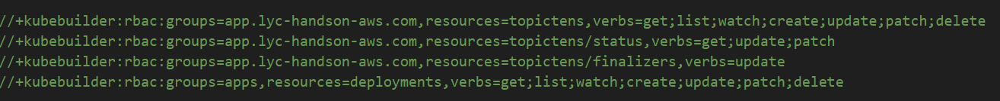


### Notice

- **after complete the API and Controller's definition, we can test our operator.** **see the operator repo's readme**, or test the operator locally by running this command `make install run`

  - `install` allows you to deploy your CRD to the cluster

  - `run` allows you to launch the controller to your cluster with the current code inside your workspace(otherwise needs to release a image and deploy the controller with it)
- we can see that i add a FluxCD `Kustomization` to point to Operator repo, path config/crd. So each time, when i validate my CRD and push to repo, my cluster will have the latest version of this CR automatically. 


## **AWS SDK for Go**

### Code

My Go code makes general use of the AWS SDK, check my code [here](https://github.com/lyc-handson-AWS/handson-topic10-go) 

Check official Doc for more details about the AWS SDK for Go [here](https://AWS.github.io/AWS-sdk-go-v2/docs/getting-started/)

### How it works:

the program retrieves 6 environment vars:

- one is ARN of a KMS Key, so the program use it to encypte a random generated message
- one is ARN of either a S3 table or a Dynamodb table, so the program write the initial message to it.
- one is ARN of a Cloud watch Log group, so the program write the encrypted message to the log group inside a specific log steam with a name composed by other 3  environment vars: pod name, pod namespace, pod ip

### Notice

1. when build go code inside a Dockerfile, it's very import to indicate the target machine where the Go bin will be run. Like mine is a alpine based image. i need to build go program with the below options for compatibility reason, otherwise the image's build will fail

```dockerfile
RUN CGO_ENABLED=0 GOOS=linux go build -a -installsuffix cgo -o myapp .
```


